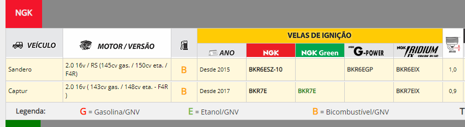

Algumas perguntas para quem recém adquiriu um RS e que pipocam sempre. Aos poucos iremos complementando. [Antes de tudo, vale você ler o manual do seu carro. 90% das dúvidas mais simples estão lá. Se você quiser, eles estão inclusive disponíveis online em PDF no site da Renault.](https://www.renault.com.br/veiculos/manuais/sandero-rs.html)

### ÍNDICE

1\. QUANTOS KM FAZ COM UM LITRO?  
2\. QUE ÓLEO USAR?  
3\. QUE PNEUS USAR? QUAL DIÂMETRO?  
4\. POSSO TIRAR A TAMPA “FOR TRACK DAY”, NA CAIXA DO FILTRO DE AR?  
5\. POSSO COLOCAR O KIT TURBO DO FLUENCE GT?  
6\. OUVI FALAR DE UM REMAP QUE DÁ 30CV. VALE FAZER?  
7\. QUANTOS CAVALOS EU GANHO COM FILTRO INBOX?  
8\. QUERIA COLOCAR UMA LÂMPADA QUE DEIXASSE A TONALIDADE PARECIDA COM A DAS DRLs. QUAL VOCÊS SUGEREM?  
9\. ACENDEU UMA LUZ AQUI. VOCÊS PODEM ME AJUDAR…?  
10\. QUERO COLOCAR VELAS DE IRIDIUM. QUAL O CÓDIGO? O QUE MELHORA?  
11\. QUE FILTROS DE ÓLEO E COMBUSTÍVEL POSSO USAR?  
12\. FLUIDO DE FREIO E ARREFECIMENTO.

### **1. QUANTOS KM FAZ COM UM LITRO?**

Depende do seu uso. Eu, por exemplo, faço 7,2 km/l em média no etanol, na cidade. Há quem não faça mais de 5,5. Mas, no geral, a média é em torno de 6 km/l urbano. Mas vamos ser sinceros? É um esportivo, se isso é uma grande preocupação sua, deveria ter comprado um Kwid.

### **2. QUE ÓLEO USAR?**

O motor do RS vai 5,5 litros   
  
Os óleos recomendados são 5w30 ou 5w40:  
   
Lubrax Supera 5w40 (muito recomendado para uso em Track Day)  
Motul 6100 5w40  
Motul 8100 X-cess 5w40 (lubrificante top)  
ELF 5w30 ou 5w40 – RN TECH (não o FE)  
Petronas Syntium 3000fr  
Ipiranga F1 Master 5w40  
Castrol Magnatech 5w30  
Gulf Formula NEO 5W40

Óleo câmbio:  
Elf 75w80 2l  
Para uso “soviético” severo: Motul 75w140 (ou Valvoline)

### **3. QUE PNEUS USAR? QUAL DIÂMETRO?**

Pneus 225/45 cabem no carro sem problemas. Tem gente que anda até com 245/40 nas rodas originais, mas usando espaçadores.

É curioso, mas pneus 225/45, embora mais largos, costumam ser mais em conta que os 205/45 que vem no RS.

[Se você quiser saber mais sobre opções, estamos escrevendo um artigo sobre as opções mais frequentes usadas pelos membros. Só clicar aqui.](https://sanderors.com.br/posts/qual-pneu-pegar/)

### **4. POSSO TIRAR A TAMPA “FOR TRACK DAY”, NA CAIXA DO FILTRO DE AR?**

Retirar a tampa do “For Track Only” é comum, 90% do RS Groupe nunca mais colocou de volta. Alguns até perderam.

Fique tranquilo, removê-la não causa nenhum impacto em durabilidade ou no dia-a-dia. Só aumenta o barulho ronco.

### **5. POSSO COLOCAR O KIT TURBO DO FLUENCE GT?**

Não venha com a ilusão de turbo do Fluence GT. Teria que trocar tanta coisa que você gastaria mais meio RS nisso e para ter um carro fraco.   
Os F4R são diferentes (do RS é o F4R 416) e câmbio também (TL4 nacional). Essas informações saíram no Flatout no lançamento do carro, mas depois de conhecer o modelo, elas deixaram de ser viáveis pelas diferenças de projetos. Mas se esse nível de preparação te interessa, fique de olho no projeto do RS200 da Ordospec.com.br

Outra possibilidade é pegar o Kit 210N da Veneno Performance, que fez o melhor tempo na [Copa Open Sandero RS.](https://www.venenoperformance.com.br/produto/kit-upgrade-de-potencia-rs-210n-nitro-veneno-performance/)

### **6. OUVI FALAR DE UM REMAP QUE DÁ 30CV. VALE FAZER?**

Seja muito cético com esses números. 30 cavalos remapeando um carro aspirado sem trocar peças é impossível. Remap sem trocar peças como coletor e escapamento é dinheiro desperdiçado, pois não vai conseguir nada que dê um melhora significativa.

Dê uma olhada neste post do [Motta da Veneno Performance falando sobre remap em carro aspirado.](https://sanderors.com.br/posts/remap-em-carro-aspirado-funciona/)

Pessoalmente, se você quer investir em alguma modificação sem gastar muito, sugerimos os [short shifters](https://www.ordospec.com.br/motor-e-cambio/novo-short-shifter-em-inox-para-renault-sandero-rs-clio-rs-mk3-e-duster-oroch-2-0/?variant=32644518) da Ordospec.

Se você entende de inglês, vale assistir o vídeo do Donut Media sobre “[melhores mods de performance para seu carro](https://www.youtube.com/watch?v=0D8sRho9tM0) que de fato funcionam”.

### **7. QUANTOS CAVALOS EU GANHO COM FILTRO INBOX?**

Se há um ganho, é marginal. Você ganha apenas um pouco no ronco que fica mais encorpado se você andar sem a tampa “for track only”.  
Existe algumas opções legais inbox: K&amp;N, RS Filtros e Inflow. O modelo da K&amp;N para o RS é o 33-3007.

### **8. QUERIA COLOCAR UMA LÂMPADA QUE DEIXASSE A TONALIDADE PARECIDA COM A DAS DRLs. QUAL VOCÊS SUGEREM?**

Uma galera usa as lâmpadas Leds da Philips, são caras e boas. Vale dizer que toda lâmpada de Led é ilegal e passível de multa e até de guincharem seu veículo para o pátio (se você for parado em uma Blitz). Nesse caso, a sugestão é que você ande com as lampadas originais no porta luvas para trocá-las caso seja parado em uma blitz. Assim, você fica apenas com uma multa.  
Para evitar isso, uma boa alternativa são halogenas mais brancas. O pessoal costuma usar as da Tech One e da marca Tiger Auto. As Philips Crystal são boas, mas além de mais caras, estão cada vez mais difíceis de encontrar originais.

### 9. **ACENDEU UMA LUZ AQUI. VOCÊS PODEM ME AJUDAR…?**

Já até imaginamos o que é. Andou errando na troca de marcha? [Dê uma lida neste post.](https://sanderors.com.br/posts/acendeu-uma-luz-aqui-voces-sabem-dizer-o-que-e/)

###  10. QUERO COLOCAR VELAS DE IRIDIUM. QUAL O CÓDIGO? O QUE MELHORA? 

O código das velas NGK que a maior parte usa é de grau 6: **NGK BKR6EIX**. Grau 6 são as velas originais para o Sandero RS e as recomendadas pela própria NGK.

Porém, não parece ser consenso – há pessoas que usam a de grau 7, **BKR7EIX**.  
O guia da NGK sugere grau 7 para o motot F4R no Captur. Possivelmente seja melhor se você roda mais no etanol.  
( *Na imagem está Captur, mas ela compartilha o motor F4R no modelo 2.0)*

Na dúvida, fique com o a original e sugerida pelo fabricante.Segundo diversos relatos de proprietários, sem mudança de consumo ou desempenho. A vantagem é que dura umas 4x mais que as originais.

### 11. QUE FILTROS POSSO USAR?

Filtro de óleo:  
N. Original: 7700873583  
W75/2 Mann (original)  
PSL77 tecfil  
PH5796 fram  
LB77 Vox

Filtro de combustível:  
N. Original: 6QE201511C  
Fram: GI0230F  
Tecfil: GI50/7  
Vox: FS50/7

### 12. FLUÍDO DE FREIO E DE ARREFECIMENTO

Fluido arrefecimento: 6,5 litros  
Fluido de freio: 1 litro Dot 4
