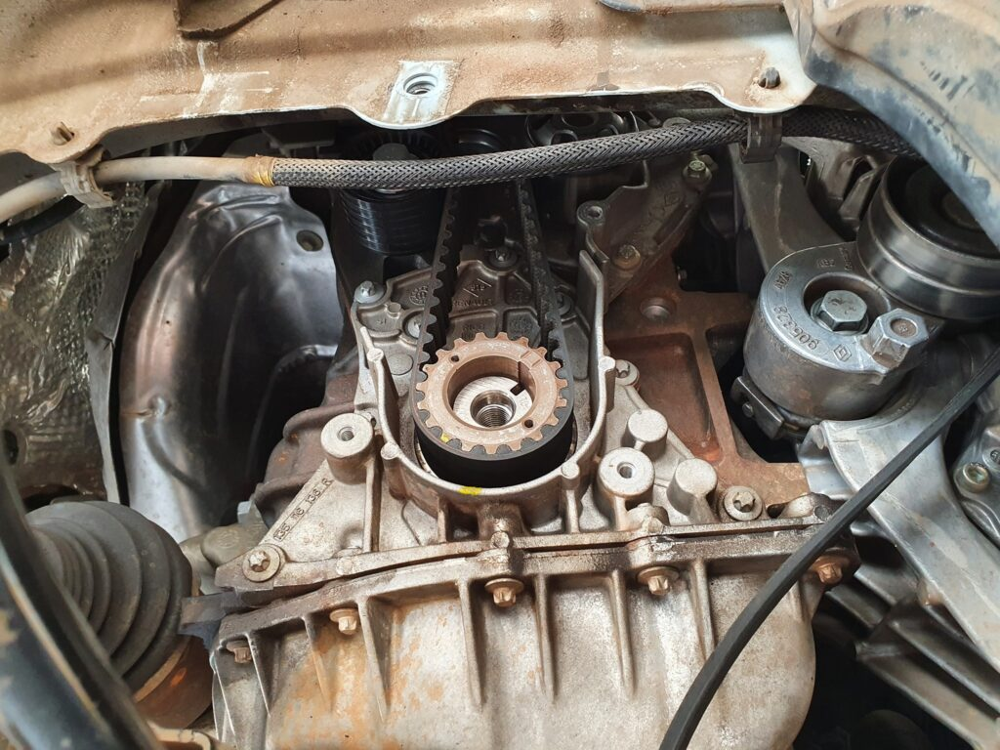

Um problema recente que diversos proprietários já haviam relatado e tem aparecido com maior frequência é em relação à borracha da tampa da correia. É uma borrachinha que tem risco de com o tempo, soltar e cair na polia com isso causar muito estrago e até atropelamento de válvulas.

A borracha em questão
O que acontece é que, com tempo, essa borracha vai soltando e pode vir parar aqui:

O canal High Torque inclusive fez um video explicando um pouco em detalhes:

Se o seu carro estiver com em torno de 4-5 anos, aproveite para na próxima revisão pedir para remover esta borrachinha. Um dos membros do grupo, o Anderson Lima, foi responsável pelas fotos e postou o seguinte. Caso você queira tentar em casa:

“Compreende em remover a roda, suspender o carro, remover proteção interna do paralama e terá acesso para retirar apenas a tampa inferior da proteção da correia dentada.Basta remover a tampa que é de plástico e retirar apenas a borda fina de borracha. Monta tudo e segue com tranquilidade. Só uma coisa, essa borracha não ferra a correia dentada, ela ferra o motor, causa atropelamento das válvulas pelos pistões. Se não for a pior coisa que pode acontecer, certamente está entre as 3 piores.”
O post [ALERTA: fique atento na borracha da tampa da correia!](https://sanderors.com/alerta-fique-atento-na-borracha-da-tampa-da-correia/) apareceu primeiro em [Sandero RS](https://sanderors.com).

