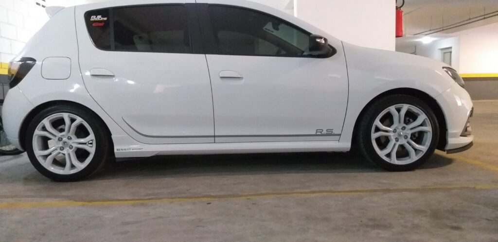

Sempre aparece alguém pedindo foto de alguém que tenha alguma mola, para saber como fica. Para facilitar sua vida, fizemos uma galera com as fotos de cada uma delas.

Ordospec R37
------------

* 
* 
* 
* 
* 
* 

Eibach Pro Kit
--------------

* 
* 
* 
* 
* 

Molas Impacto
-------------

* 
* 

Ordospec Street
---------------

* 
* 

Ah! Assista também o vídeo do Victor da Ayuso Garage com um breve comparativo dessas molas no RS:

O post [“Altura” das molas esportivas](https://sanderors.com/altura-das-molas-esportivas/) apareceu primeiro em [Sandero RS](https://sanderors.com).

