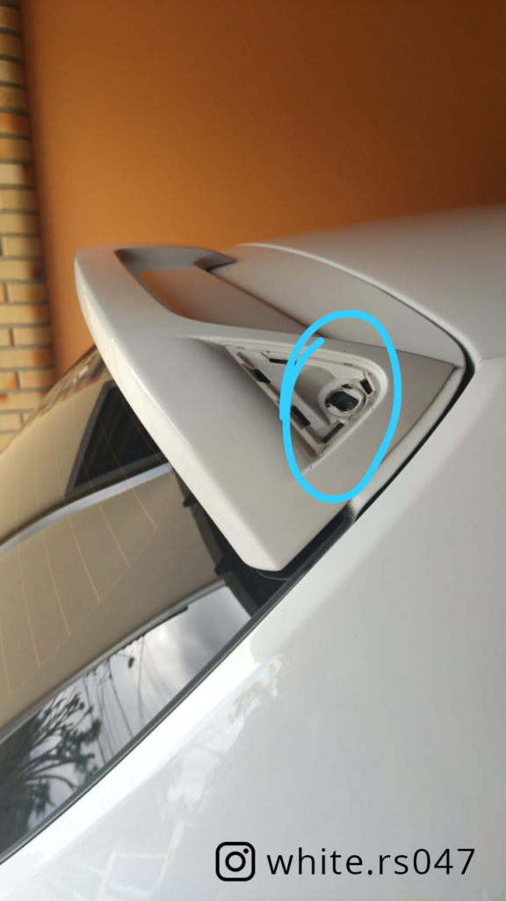
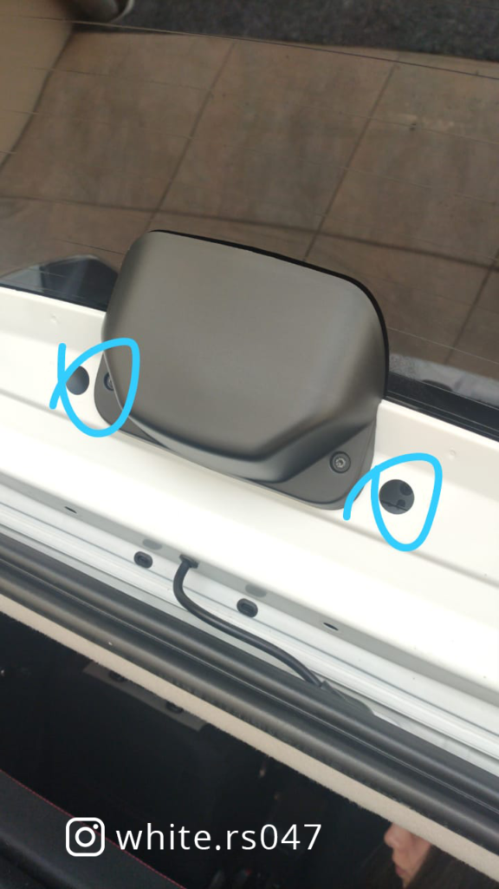
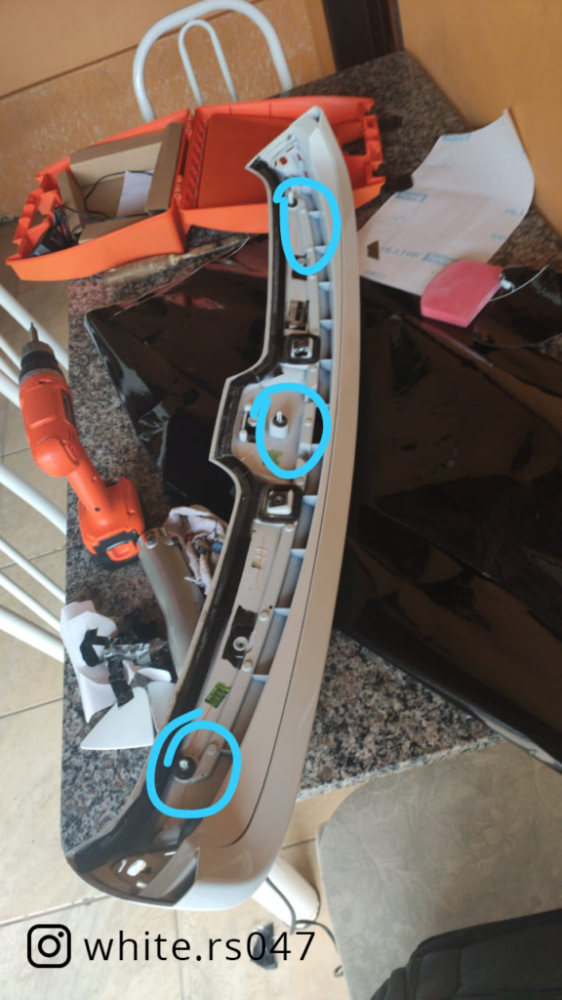
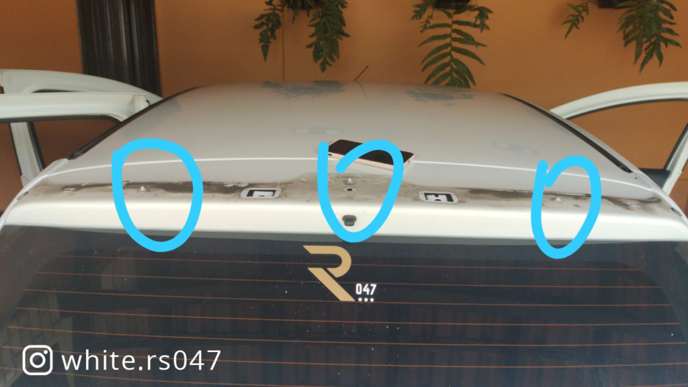

O Vanderlei, proprietário o [@white.rs047](http://instagram.com/white.rs047) no instagram, fez um tutorial visual de como desmontar o Spoiler. Muito prático.

Primeiro de tudo, remova com cuidado para não marcar, usando uma espátula, as tampas laterais. Em seguida, remova os dois parafusos contidos dentro, apontados neste local.
Em seguida, abra a tampa do porta malas e, por dentro, remova estes dois parafusos.
* 
* 

Por último, ele é preso por presilhas de pressão, similares às usadas em peças de forramento do interior do carro. Retire forçando com a espátula de nylon. 

O post [Como desmontar o aerofólio](https://sanderors.com/como-desmontar-o-aerofolio/) apareceu primeiro em [Sandero RS](https://sanderors.com).

