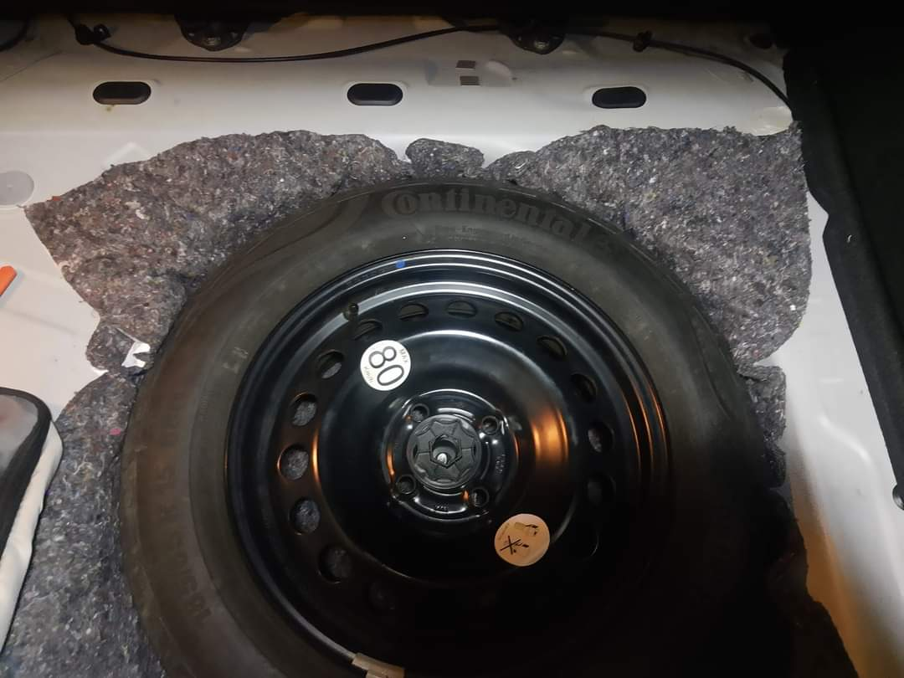
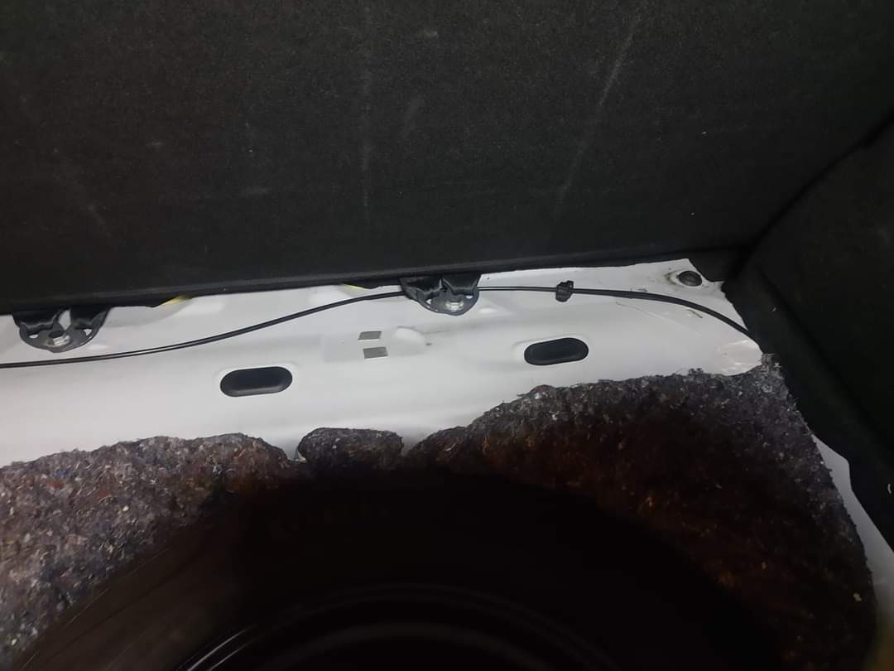
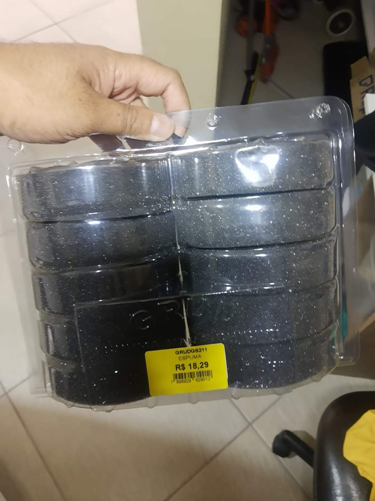
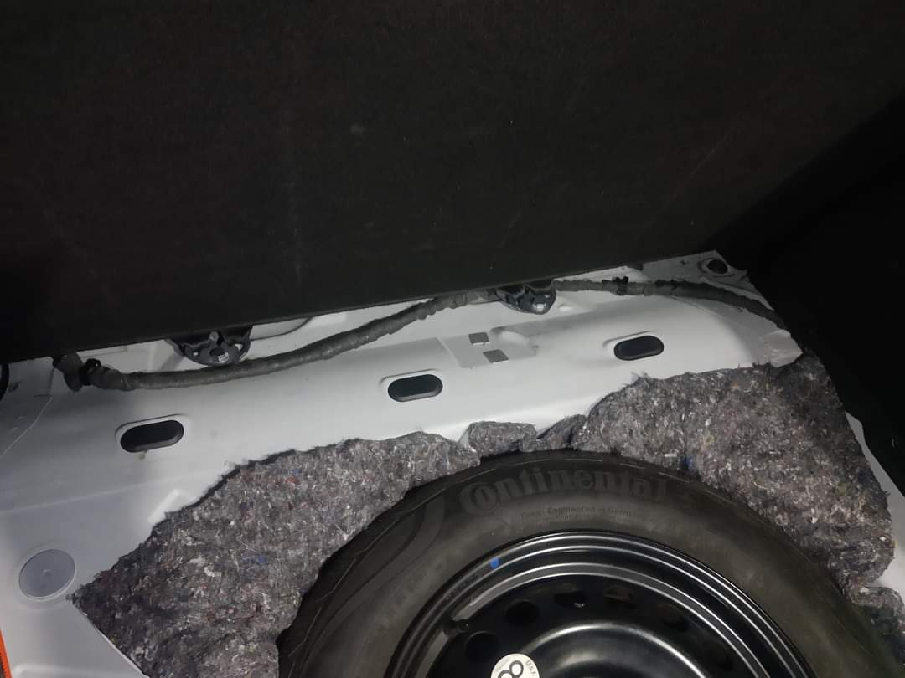
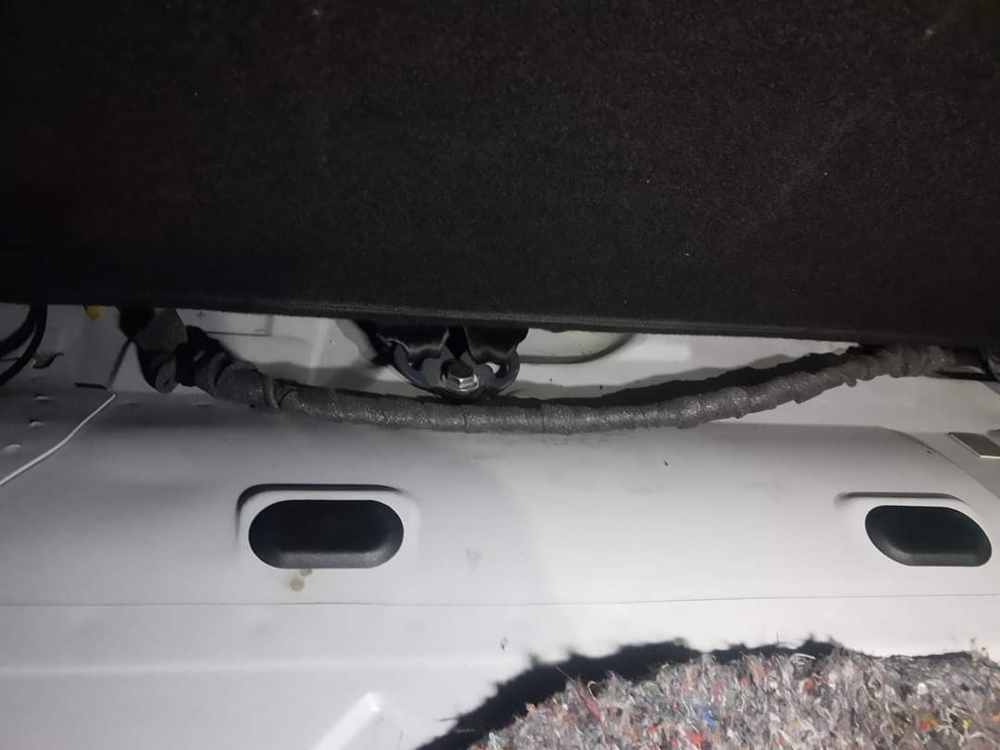

Vim compartilhar com vocês 2 soluções para remover alguns dos barulhos atrás do Sandero RS.

Na primeira foto, coloquei uma manta anti-ruido, é um pedaço de 1m por 1m, essa que eu comprei é com cola, mas não quis colar, o estepe ficou bem firme na manta e diminuiu um dos ruidos.

Um dos barulhos que ocorre atrás é dos cabos de aço, principalmente o cabo de aço da port láa do bocal do tanque, ele é preso nas duas presilhas, mas ele acaba vibrando na lata, usei espuma para chicote sem cola, e revesti o cabo do tanque e solucionou bastante!

### Cabo Sem Encapar

### Espuma 

### Cabo Encapado

Tomara que essas dicas ajudem vocês!

Abraço!