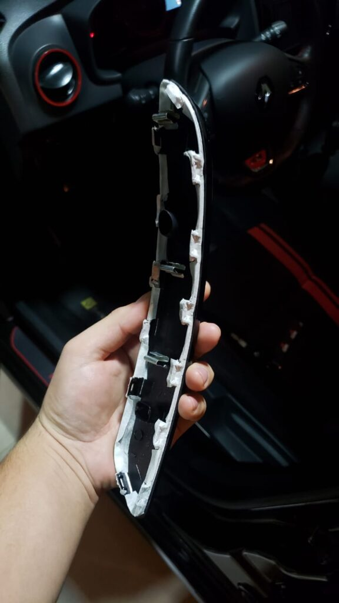
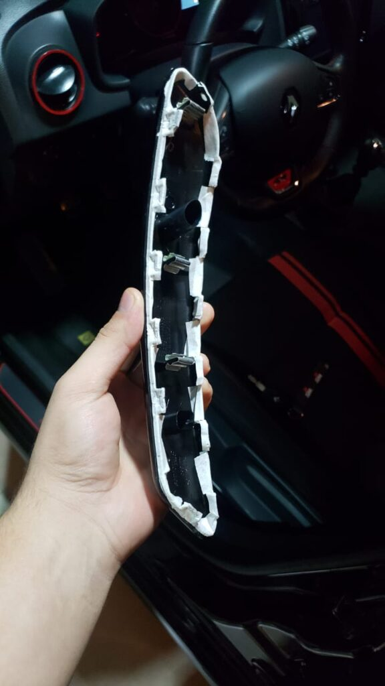

O Junio Ferrarezi deu lá no grupo um easy fix realmente muito simples para esse problema. Só cobrir essa parte interna com fita crepe. E fazer o acabamento com um estilete.

* 
* 

O post [Como tirar o rangido do puxador da porta](https://sanderors.com/como-tirar-o-rangido-do-puxador-da-porta/) apareceu primeiro em [Sandero RS](https://sanderors.com).

