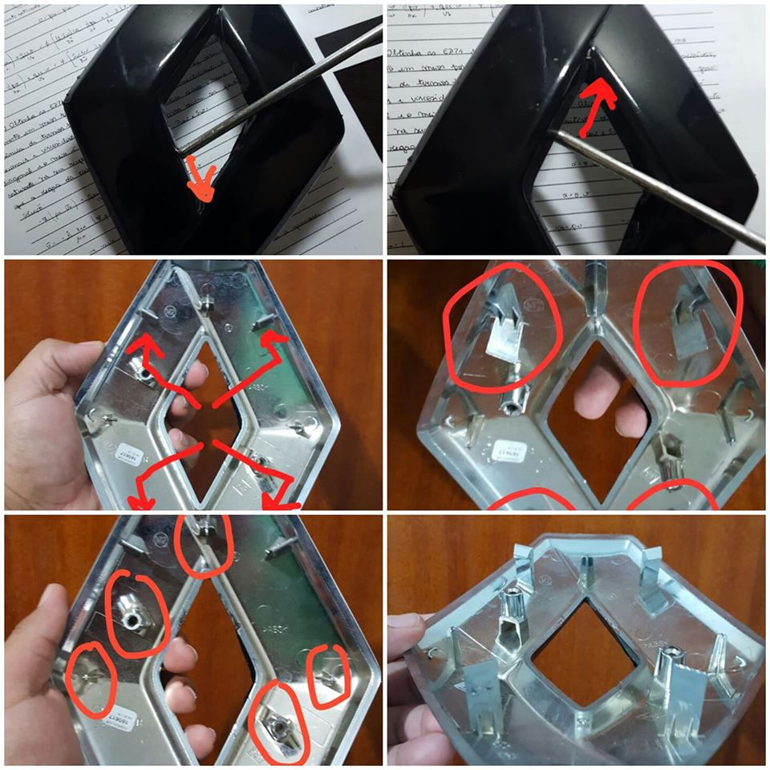

   
Por essa foto se vê o local das travas do símbolo, com cuidado dá para colocar uma chave de fenda e soltar a trava. Cuidado para não quebrar. Autoria deste “tutorial” não é minha.
Vídeo abaixo feito pelo Matheus Wolkning, lá do grupo:

O post [Como tirar o simbolo dianteiro?](https://sanderors.com/como-tirar-o-simbolo-dianteiro/) apareceu primeiro em [Sandero RS](https://sanderors.com).

