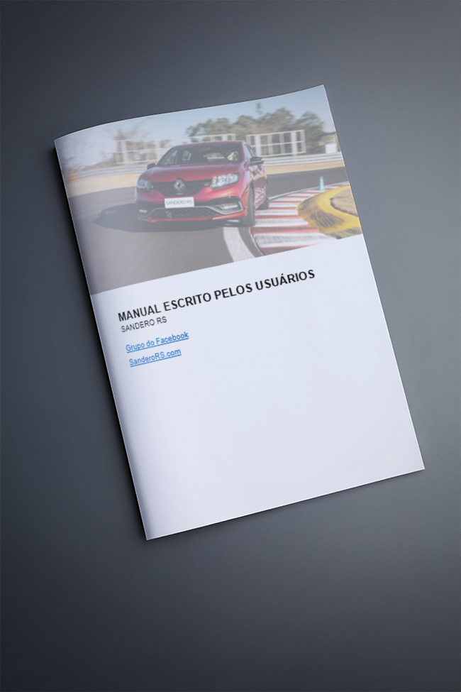

Temos um grupo de Whatsapp onde o pessoal discute questões técnicas do RS e “buracos” de informação que temos no manual original, como: quanto óleo vai no câmbio, qual óleo vai no câmbio, recomendação de manutenção e por aí vai.

O grupo se uniu e montamos uma espécie de “manual alternativo” com todas essas dúvidas. Clique na imagem abaixo ou acesse pelo link: [manual-rs-edicao-do-grupo.docx](manual-rs-edicao-do-grupo.docx)

O post [Manual do Sandero RS – versão da comunidade](https://sanderors.com/manual-do-sandero-rs-versao-da-comunidade/) apareceu primeiro em [Sandero RS](https://sanderors.com).

