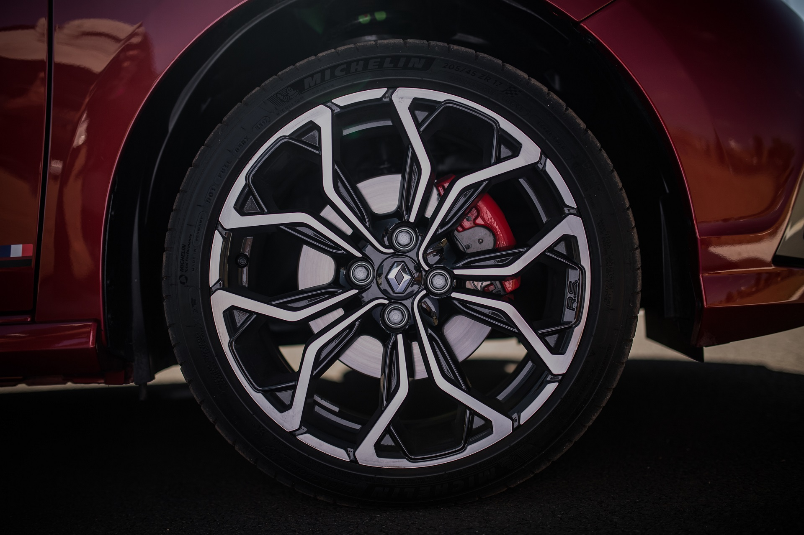
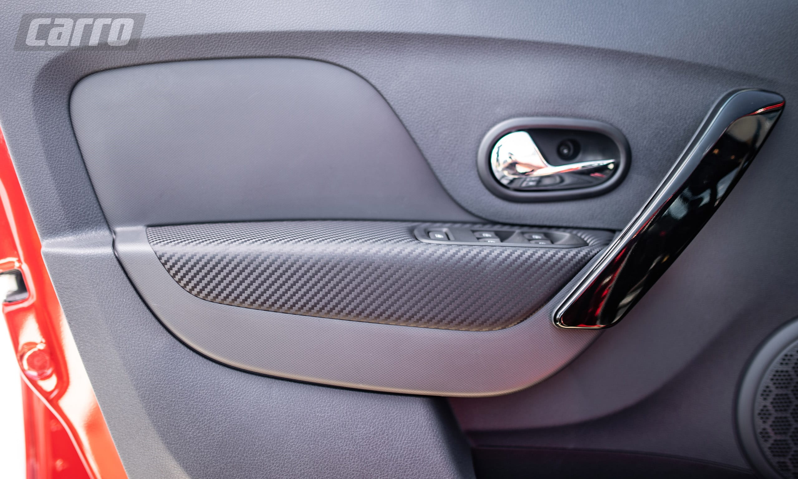
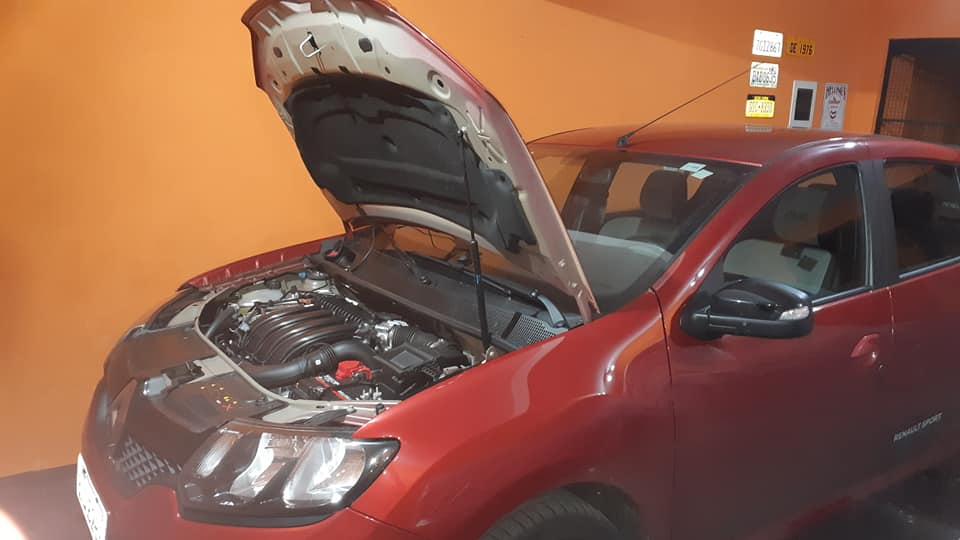

Bom… como mudou a traseira apenas, nem sei se dá pra chamar de FACE lift. Talvez “backlift”? Enfim, a lista foi compilada pelo RS Groupe Nacional no Whatsapp.

1) Pneus Pilot Sport 4 – como os que vinham nos Racing Spirit  
2) Módulo de subida do vidro  
3) Aviso do cinto no painel  
4) Teto e colunas preto  
5) Roda nova  

6) Pisca – 3 segundos ao tocar no comando  
7) Medidor de temperatura da água  
8) Media Nav – nova central multimídia *Media* Evolution com Android Auto  
9) Isofix – Já estava presente nos modelos 2018+  
10) 3 apoios de cabeça traseiro  
11) 20 kg mais pesado – por conta de reforços estruturais  
12) abertura eletrica do porta malas

13) Chave canivete  

14) Aerofólio preto  
15) Imitação de acabamento em fibra de carbono na porta  
  

16) 4 airbags  
17) Iluminacao do painel  
18) nova tampa traseira  
19) lanternas de led  
21) Nova faixa lateral  
22) câmera de ré de série  
23) lampadas de placa dupla  
24) 3 cintos de 3 pontos traseiro  
25) Reforço estrutural dianteiro com mais pontos de solda  
26) botoes do vidro traseiro na lateral do motorista  
27) estrutura e espuma dos bancos  
28) melhoria nos anéis sincronizadores do câmbio, conhecidos por serem um problema crônico do modelo  
29) Cofre do motor não é mais pintado  

O post [O que mudou para o RS modelo 2020 além do facelift?](https://sanderors.com/o-que-mudou-para-o-rs-modelo-2020-alem-do-facelift/) apareceu primeiro em [Sandero RS](https://sanderors.com).

