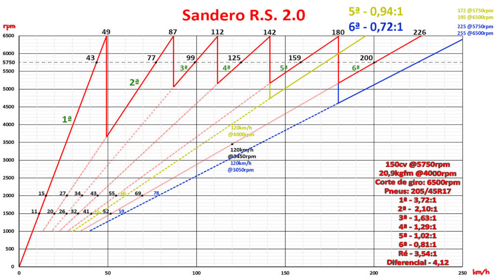
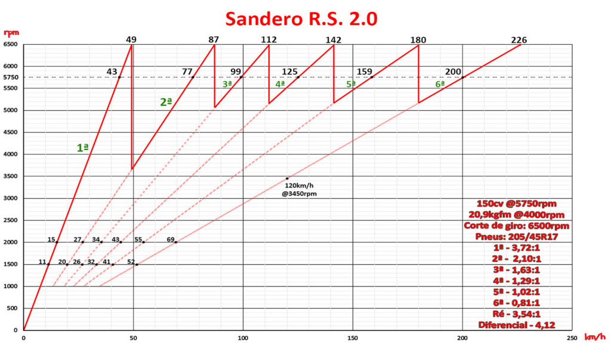
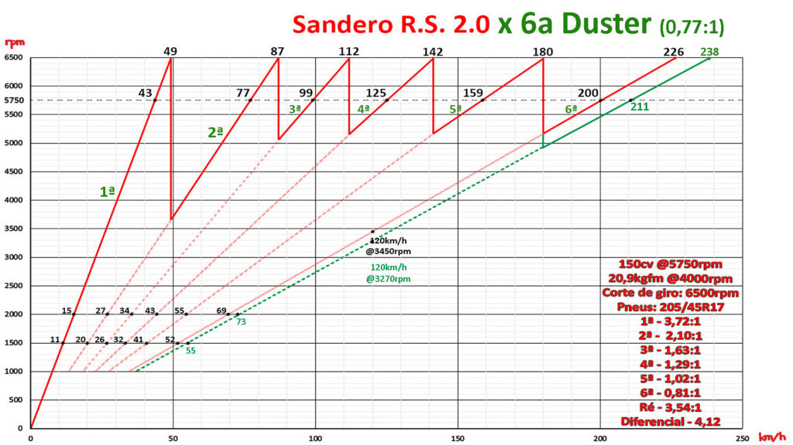

E comparando com o câmbio da Duster. Material de autoria do Giovanni Tani.

* 
* 
* 

O post [Relação de câmbio do RS](https://sanderors.com/relacao-de-cambio-do-rs/) apareceu primeiro em [Sandero RS](https://sanderors.com).

