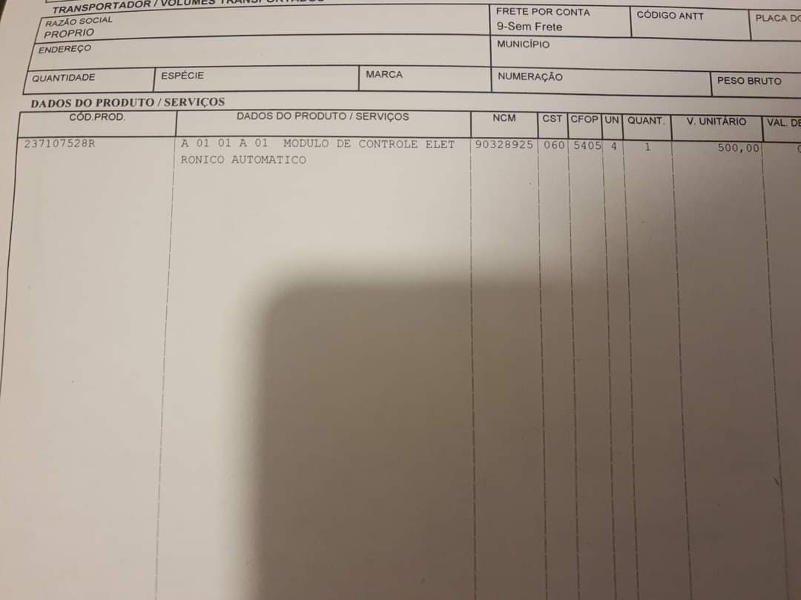
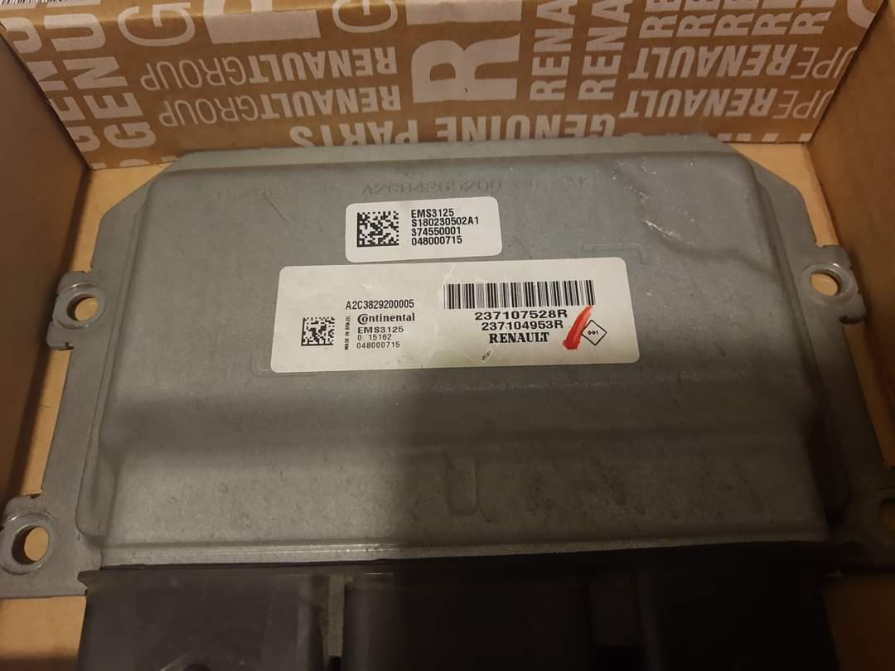

Se o Seu Sandero começou a fazer esse problema, pode ser algo relacionado a ECU do seu RS!.

Toda vez que eu estava com o ar ligado o carro acabava dando um reset muito estranho ( video abaixo ), e quando esse erro acontecia varias vezes o carro entrava em modo de emergência e só voltava tirando a bateria e colocando novamente, e passando o scanner acusava o erro P061a

Abaixo o video acontecendo o erro



Verifiquei com o Daniel da HomeGarage, ele analisou e verificou que havia algum problema na ECU (pelo que me lembro era no calculador)

Fui na concessionaria e alegaram o mesmo problema, necessitei realizar a troca da ECU, me custou 

Bom, fui na concessionária, e foi diagnosticado com o problema no calculador e precisaria substituir a ECU.

Milagrosamente a ECU custa 500 reais, ja pedi a troca da mesma e solucionou o problema, o foda foi a mão de obra de 1160 pra fazer esse serviço, achei um absurdo, mas queria resolver o problema

Abaixo deixo a foto da nota e do numero da peça!

